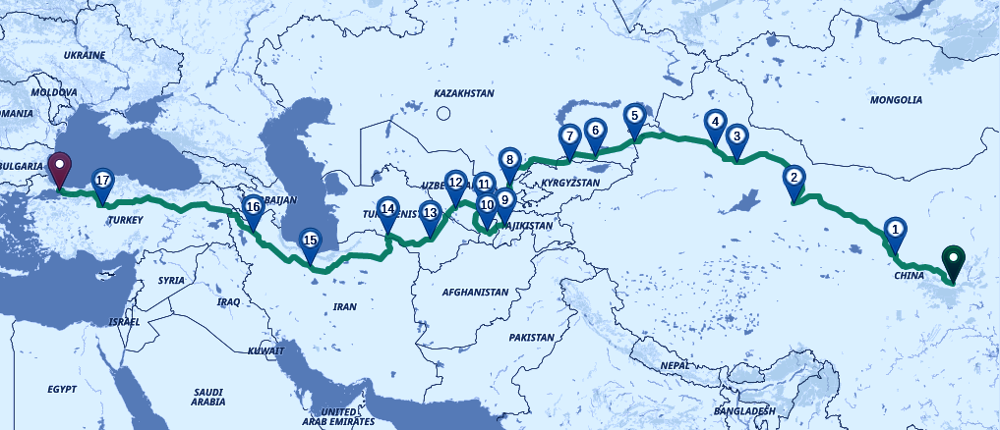

# Nomad Cyclist Problem

A variation of Traveling Salesman Problem to help plan long Cycling Tours.

## Getting Started
Clone this project
```sh
git clone https://github.com/emadehsan/nomad-cyclist
```

Install requirements

```sh
pip3 install -r requirements.txt
```

Open and read [`app.py`](./app.py). It is well written and explained.

## Contribute
Feel free to make a pull request :)